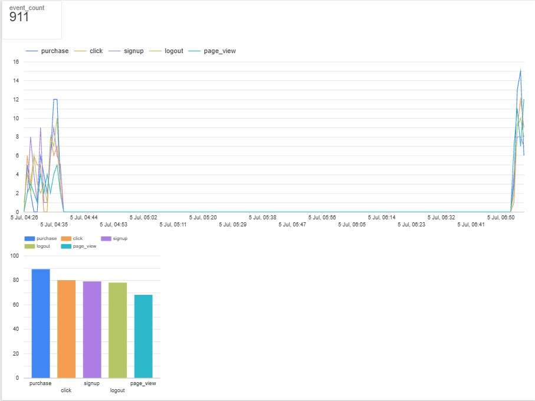

# StreamSight — Real-Time Event Analytics Platform

A cloud-native, real-time event analytics pipeline built on Google Cloud. StreamSight ingests high-throughput streaming events, processes them with windowed aggregation, persists results to BigQuery, detects anomalies, and visualizes live metrics through a Looker Studio dashboard.

---

## Architecture

```
Event Publisher (Python)
|
v
Google Cloud Pub/Sub  (streamsight-events)
|
v
Apache Beam / Google Cloud Dataflow

Parse event payloads
Fixed windowing (10-sec buckets)
Early triggers for live updates
Per-window aggregation (count by event_type)
|
v
Google BigQuery  (streamsight_data.event_counts)
|
v
Anomaly Detection (Python / pandas / scikit-learn)
Z-score thresholding (per event_type, |z| > 2)
Isolation Forest (per event_type, contamination=0.05)
|
v
Google BigQuery  (streamsight_data.anomaly_results)
|
v
Looker Studio Dashboard
Total event scorecard
Time series trend
Event type breakdown (bar chart)
Anomalies Detected table (filtered on is_anomaly_iforest)

```

## Technologies Used

- **Google Cloud Pub/Sub** — real-time message ingestion
- **Apache Beam / Google Cloud Dataflow** — stream processing, windowing, aggregation
- **Google BigQuery** — structured storage for analytical querying
- **pandas** — data manipulation and z-score computation
- **scikit-learn** — Isolation Forest anomaly detection
- **google-cloud-bigquery** — reading/writing BigQuery tables from Python
- **Looker Studio** — live dashboard visualization
- **Python** — pipeline, anomaly detection, and event simulation code

## Features

- Simulated real-time event generator (click, page_view, purchase, signup, logout)
- Streaming pipeline with fixed 10-second windows and early/live triggers
- Autoscaling Dataflow deployment (1–100 workers)
- Structured BigQuery schema (`window_start`, `window_end`, `event_type`, `event_count`)
- Anomaly detection layer combining statistical (z-score) and ML-based (Isolation Forest) methods
- Live dashboard: total events, trend over time, breakdown by event type, and flagged anomalies
- Cost controls: billing budget alert, soft-delete disabled, clean job shutdown process

## Project Structure

```
StreamSight/
├── publisher.py              # Simulates and publishes fake events to Pub/Sub
├── beam_test.py               # Local Beam pipeline test (no windowing)
├── beam_windowing_test.py     # Local Beam pipeline test (with windowing)
├── streaming_pipeline.py      # Full pipeline: Pub/Sub -> Beam -> BigQuery (local & Dataflow)
├── anomaly_detection.py       # Reads event_counts, flags anomalies, writes anomaly_results
└── README.md
```

## Setup & Usage

### Prerequisites
- Google Cloud account with billing enabled (free trial credit is sufficient)
- Python 3.10+, `gcloud` CLI installed and authenticated
- APIs enabled: Pub/Sub, Dataflow, BigQuery, Compute Engine

### 1. Clone and set up environment
```
git clone <your-repo-url>
cd StreamSight
python -m venv streamsight-env
streamsight-env\Scripts\activate   # Windows
pip install google-cloud-pubsub google-cloud-bigquery apache-beam[gcp] pandas scikit-learn
```

### 2. Create GCP resources
```
gcloud pubsub topics create streamsight-events
gcloud pubsub subscriptions create streamsight-events-sub --topic=streamsight-events

bq mk --dataset --location=<your-region> <project-id>:streamsight_data
bq mk --table <project-id>:streamsight_data.event_counts \
  window_start:TIMESTAMP,window_end:TIMESTAMP,event_type:STRING,event_count:INTEGER

bq mk --table <project-id>:streamsight_data.anomaly_results \
  window_start:TIMESTAMP,window_end:TIMESTAMP,event_type:STRING,event_count:INTEGER,zscore:FLOAT,is_anomaly_zscore:BOOLEAN,is_anomaly_iforest:BOOLEAN

gcloud storage buckets create gs://<your-bucket-name> --location=<your-region>
```

### 3. Run locally (no cloud cost)
```
python publisher.py            # Terminal 1 — generates fake events
python streaming_pipeline.py   # Terminal 2 — processes events, writes to BigQuery
```

### 4. Deploy to Dataflow (cloud)
Update `streaming_pipeline.py` `PipelineOptions` with `runner="DataflowRunner"`, your project ID, region, and GCS bucket paths, then run:
```
python streaming_pipeline.py
```
**Important:** Cancel the Dataflow job when done testing to avoid ongoing charges:
```
gcloud dataflow jobs list --region=<your-region>
gcloud dataflow jobs cancel <JOB_ID> --region=<your-region>
```

### 5. Run anomaly detection
Once `event_counts` has data, run:

```
python anomaly_detection.py
```
This pulls all windowed event counts, flags anomalies using both z-score thresholding and Isolation Forest, saves a local `anomaly_results.csv`, and writes the results to `streamsight_data.anomaly_results` in BigQuery.

### 6. View the dashboard
Connect a Looker Studio report to the `streamsight_data.event_counts` and `streamsight_data.anomaly_results` BigQuery tables. See screenshots below.

## Anomaly Detection

After event counts are aggregated into 10-second windows in BigQuery, a separate
Python script (`anomaly_detection.py`) pulls the data and flags unusual spikes or
drops in activity using two complementary methods:

### 1. Z-Score Thresholding (Statistical)
For each `event_type`, the script computes the mean and standard deviation of
`event_count` across all windows, then flags any window where the z-score
exceeds ±2. This is a fast, interpretable baseline: it catches any window that
deviates meaningfully from that event type's typical volume.

### 2. Isolation Forest (Machine Learning)
For each `event_type`, an `IsolationForest` model (scikit-learn, `contamination=0.05`)
is fit on `event_count` values to identify the most extreme outliers without
assuming a normal distribution. This method is stricter and tends to surface a
smaller, high-confidence subset of anomalies.

### Combining Both Methods
Both flags (`is_anomaly_zscore`, `is_anomaly_iforest`) are stored side by side,
so results can be compared directly. In practice, every anomaly flagged by
Isolation Forest was also flagged by the z-score method — meaning Isolation
Forest surfaces a stricter subset within the broader set of statistically
unusual windows. This gives two confidence levels: a broad "worth a look" signal
(z-score) and a narrow "high-confidence" signal (Isolation Forest).

Results are written back to BigQuery (`streamsight_data.anomaly_results`) and
surfaced on the Looker Studio dashboard in a dedicated **Anomalies Detected**
table, filtered to `is_anomaly_iforest = true`.

## Dashboard Preview

_The screenshot of Looker Studio dashboard is here._





## Key Design Decisions

- **Fixed windows (10s) with early triggers**: balances near-real-time visibility with manageable write volume to BigQuery, rather than writing on every single event.
- **`AccumulationMode.DISCARDING`**: each trigger fire emits only new counts since the last firing, avoiding duplicate/cumulative totals.
- **Autoscaling Dataflow workers (1–100)**: keeps cost low during idle periods and scales up automatically under load.
- **Region selection**: Pub/Sub and BigQuery resources are hosted in the lowest-latency region for the primary user base; Dataflow worker region can be adjusted independently for capacity availability.
- **Two anomaly detection methods run side by side**: z-score gives a fast, interpretable baseline; Isolation Forest gives a stricter, distribution-free check. Storing both flags lets the two approaches be compared directly rather than picking one blindly.

## Lessons Learned

- Fixed windows align to absolute epoch time, not pipeline start time — a subtle behavior that affects how test data must be timestamped to validate aggregation logic.
- Streaming Dataflow jobs bill continuously and must be explicitly cancelled; local `DirectRunner` testing is the safer/cheaper way to iterate before cloud deployment.
- Regional compute capacity can be temporarily exhausted on smaller cloud regions; a fallback region (e.g., `us-central1`) is useful for reliability.
- `DataFrameGroupBy.apply` in pandas passes grouping columns into the applied function by default (soon to change); care is needed when combining `groupby` with per-group transformations that also need the group key.

## Possible Future Improvements

- Partition the BigQuery table by `window_start` for cost efficiency at scale
- Add integration tests for the pipeline transforms
- Parameterize region/project/bucket via environment variables or a config file
- Tune Isolation Forest `contamination` and z-score threshold based on observed false-positive rate over a longer data history
- Add alerting (e.g., email/Slack) when new anomalies are written to `anomaly_results`

## Author

Built as a self-directed learning project to understand real-time streaming architecture on Google Cloud.


----------------------------------------------------------------------------------------------------------------------------------------------------------------------------------------------------------------------------
